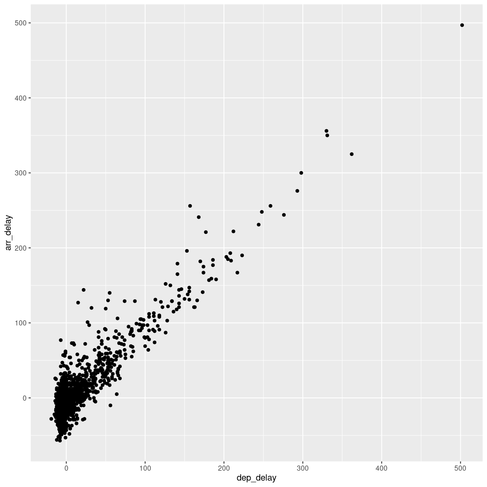

---
# Please do not edit this file directly; it is auto generated.
# Instead, please edit 01-intro-to-r.md in _episodes_rmd/
title: "Getting started"
teaching: 30
exercises: 10
questions:
- "FIXME"
objectives: 
- "FIXME"
keypoints:
- "FIXME"
source: Rmd
---

## Read in data in R

First we load `tidyverse` which make datamanipulation easier. We also load a 
package to help us read Excel files:

~~~
library(tidyverse)
library(readxl)
~~~
{: .language-r}

In order to do useful and interesting things, we need to assign _values_ to
_objects_. To create an object, we need to give it a name followed by the
assignment operator `<-`, and the value we want to give it.

The value in this case, is the result of reading an Excel file:

~~~
flightdata <- read_excel("data/flightdata.xlsx")
~~~
{: .language-r}

# Taking a look at the data

Always begin by taking a look at your data!

In this case it is the function sample_frac() that takes the input, flightdata, and returns a random fraction of the data. 0.005 in this case. 
The dataset is pretty large. 

The summary function returns summary statistics on our data:

~~~
summary(flightdata)
~~~
{: .language-r}

~~~
      year          month             day           dep_time    sched_dep_time
 Min.   :2013   Min.   : 1.000   Min.   : 1.00   Min.   :   1   Min.   : 106  
 1st Qu.:2013   1st Qu.: 4.000   1st Qu.: 8.00   1st Qu.: 907   1st Qu.: 906  
 Median :2013   Median : 7.000   Median :16.00   Median :1401   Median :1359  
 Mean   :2013   Mean   : 6.549   Mean   :15.71   Mean   :1349   Mean   :1344  
 3rd Qu.:2013   3rd Qu.:10.000   3rd Qu.:23.00   3rd Qu.:1744   3rd Qu.:1729  
 Max.   :2013   Max.   :12.000   Max.   :31.00   Max.   :2400   Max.   :2359  
                                                 NA's   :8255                 
   dep_delay          arr_time    sched_arr_time   arr_delay       
 Min.   : -43.00   Min.   :   1   Min.   :   1   Min.   : -86.000  
 1st Qu.:  -5.00   1st Qu.:1104   1st Qu.:1124   1st Qu.: -17.000  
 Median :  -2.00   Median :1535   Median :1556   Median :  -5.000  
 Mean   :  12.64   Mean   :1502   Mean   :1536   Mean   :   6.895  
 3rd Qu.:  11.00   3rd Qu.:1940   3rd Qu.:1945   3rd Qu.:  14.000  
 Max.   :1301.00   Max.   :2400   Max.   :2359   Max.   :1272.000  
 NA's   :8255      NA's   :8713                  NA's   :9430      
   carrier              flight       tailnum             origin         
 Length:336776      Min.   :   1   Length:336776      Length:336776     
 Class :character   1st Qu.: 553   Class :character   Class :character  
 Mode  :character   Median :1496   Mode  :character   Mode  :character  
                    Mean   :1972                                        
                    3rd Qu.:3465                                        
                    Max.   :8500                                        
                                                                        
     dest              air_time        distance         hour      
 Length:336776      Min.   : 20.0   Min.   :  17   Min.   : 1.00  
 Class :character   1st Qu.: 82.0   1st Qu.: 502   1st Qu.: 9.00  
 Mode  :character   Median :129.0   Median : 872   Median :13.00  
                    Mean   :150.7   Mean   :1040   Mean   :13.18  
                    3rd Qu.:192.0   3rd Qu.:1389   3rd Qu.:17.00  
                    Max.   :695.0   Max.   :4983   Max.   :23.00  
                    NA's   :9430                                  
     minute        time_hour                     
 Min.   : 0.00   Min.   :2013-01-01 10:00:00.00  
 1st Qu.: 8.00   1st Qu.:2013-04-04 17:00:00.00  
 Median :29.00   Median :2013-07-03 14:00:00.00  
 Mean   :26.23   Mean   :2013-07-03 09:22:54.64  
 3rd Qu.:44.00   3rd Qu.:2013-10-01 11:00:00.00  
 Max.   :59.00   Max.   :2014-01-01 04:00:00.00  
                                                 
~~~
{: .output}

~~~
flightdata %>% 
  filter(dep_delay == 0) %>% 
  nrow()
~~~
{: .language-r}

~~~
[1] 16514
~~~
{: .output}

What is actually contained in this dataset, what are the meaning of 
the column names?

* year, month, day Date of departure.
* dep_time, arr_time Actual departure and arrival times (format HHMM or HMM), local tz.
* sched_dep_time, sched_arr_time Scheduled departure and arrival times (format HHMM or HMM), local tz.
* dep_delay, arr_delay Departure and arrival delays, in minutes. Negative times represent early departures/arrivals.
* carrier Two letter carrier abbreviation. See airlines to get name.
* flight Flight number.
* tailnum Plane tail number. See planes for additional metadata.
* origin, dest Origin and destination. See airports for additional metadata.
* air_time Amount of time spent in the air, in minutes.
* distance Distance between airports, in miles.
* hour, minute Time of scheduled departure broken into hour and minutes.
* time_hour Scheduled date and hour of the flight as a POSIXct date. Along with origin, can be used to join flights data to weather data.

Always remember to save information about what is actually in your 
data. This is called metadata, data that describes data. 

## Let us make a plot

~~~
flightdata %>% 
  sample_frac(.005) %>% 
  ggplot(mapping = aes( x = dep_delay, y = arr_delay)) +
  geom_point()
~~~
{: .language-r}

~~~
Warning: Removed 50 rows containing missing values (`geom_point()`).
~~~
{: .warning}

Note that the pipe is not a pipe in plots. Its a +.

Mapping denotes which values from the data, should be mapped to 
something in the plot. The "somethings" depends on the type of plot. We are making a scatter plot, using geom_point, because we are plotting points. They have a minimum requirement of x and y.


