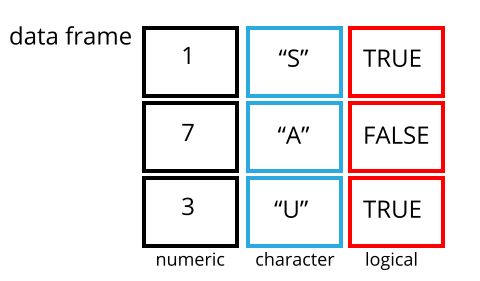

---
# Please do not edit this file directly; it is auto generated.
# Instead, please edit 02-starting-with-data.md in _episodes_rmd/
title: "Starting with Data"
teaching: 30
exercises: 10
questions:
- "What is a data.frame?"
- "How can I read a complete csv file into R?"
- "How can I get basic summary information about my dataset?"
objectives:
- "Describe what a data frame is."
- "Load external data from a .csv file into a data frame."
- "Summarize the contents of a data frame."
- "Subset and extract values from data frames."
keypoints:
- "Use read_csv to read tabular data in R."
source: Rmd
---

## Looking at parts of the dataset

There are a lot of columns here. If we want to look at only a subset of them
we can run this command:

~~~
library(tidyverse)
~~~
{: .language-r}

~~~
── Attaching packages ─────────────────────────────────────── tidyverse 1.3.2 ──
✔ ggplot2 3.4.0      ✔ purrr   0.3.5 
✔ tibble  3.1.8      ✔ dplyr   1.0.10
✔ tidyr   1.2.1      ✔ stringr 1.5.0 
✔ readr   2.1.3      ✔ forcats 0.5.2 
── Conflicts ────────────────────────────────────────── tidyverse_conflicts() ──
✖ dplyr::filter() masks stats::filter()
✖ dplyr::lag()    masks stats::lag()
~~~
{: .output}

~~~
flightdata %>% 
  select(carrier, dep_delay, arr_delay)
~~~
{: .language-r}

~~~
Error in select(., carrier, dep_delay, arr_delay): object 'flightdata' not found
~~~
{: .error}

There are still a LOT of rows. As long as we do not actually want to work with
the entire dataset, looking at the first few rows can be a good idea.

The head() function shows us the first 6 rows.

~~~
flightdata %>% 
    select(carrier, dep_delay, arr_delay) %>% 
    head()
~~~
{: .language-r}

~~~
Error in select(., carrier, dep_delay, arr_delay): object 'flightdata' not found
~~~
{: .error}

## What are data frames and tibbles?

Data frames are the _de facto_ data structure for tabular data in `R`, and what
we use for data processing, statistics, and plotting.

A data frame is the representation of data in the format of a table where the
columns are vectors that all have the same length. Data frames are analogous to
the more familiar spreadsheet in programs such as Excel, with one key difference.
Because columns are vectors,
each column must contain a single type of data (e.g., characters, integers,
factors). For example, here is a figure depicting a data frame comprising a
numeric, a character, and a logical vector.

Data frames can be created by hand, but most commonly they are generated by the
functions `read_csv()` or `read_table()`; in other words, when importing
spreadsheets from your hard drive (or the web). 

## Summary statistics

What is the average delay on the departure of these flights?

Most of the functions we use for these operations comes from the library
dplyr, which is part of the tidyverse package.

The function to get summary statistics (average/mean, median, standard deviation etc)
from dataframes is *summarise*. It works like this:

~~~
flightdata %>% 
  summarise(avg_dep_delay = mean(dep_delay))
~~~
{: .language-r}

~~~
Error in summarise(., avg_dep_delay = mean(dep_delay)): object 'flightdata' not found
~~~
{: .error}

Oops! That was not the result we wanted. 

## Missing data

Missing data is data that should be there. But isn't. The delay might have been
0 minutes. Or -5 minutes if the flight arrived early. But we should have a 
value for delay. There are many was of handling missing data. In R, only one of
them is the right.

Missing data is encoded as the special value "NA". It means that we have no
idea what the value is. But that it should be there. It can be anything.

Therefore we cant calculate a mean value. The average of "4" and "no idea" is
"no idea", or, NA.

Most functions have an optional argument that specifies how missing values are
handled. 

We can find them in the help for that function, and for mean() it is specified
with "na.rm". By default "na.rm = FALSE", that is, the function will not remove
NA-values. 

If we set "na.rm = TRUE" missing values will be stripped from the data, before 
the average is calculated.

## once more, without NAs

~~~
flightdata %>% 
  summarise(avg_dep_delay = mean(dep_delay, na.rm = T))
~~~
{: .language-r}

~~~
Error in summarise(., avg_dep_delay = mean(dep_delay, na.rm = T)): object 'flightdata' not found
~~~
{: .error}

Note that we can write "T" instead of "TRUE". Likewise we could write "F" 
instead of "FALSE", saving 3-4 keystrokes.

## Which airline is most on time?

If we want to get the averege departure delay for a specific company, we
could filter for a specific name of the carrier:

~~~
flightdata %>% 
  filter(carrier == "UA") %>% 
  summarise(avg_dep_delay = mean(dep_delay, na.rm = T))
~~~
{: .language-r}

~~~
Error in filter(., carrier == "UA"): object 'flightdata' not found
~~~
{: .error}

We could then do the same for every carrier. That is cumbersome.

Instead dplyr have a function that allow us to group the dataframe based on a
column, and do the subsequent operations on those groups:

~~~
flightdata %>% 
  group_by(carrier) %>% 
  summarise(avg_dep_delay = mean(dep_delay, na.rm = T))
~~~
{: .language-r}

~~~
Error in group_by(., carrier): object 'flightdata' not found
~~~
{: .error}

Much better! 

A final step would be to sort the carriers by the average departure delay:

~~~
flightdata %>% 
  group_by(carrier) %>% 
  summarise(avg_dep_delay = mean(dep_delay, na.rm = T)) %>% 
  arrange(avg_dep_delay)
~~~
{: .language-r}

~~~
Error in group_by(., carrier): object 'flightdata' not found
~~~
{: .error}

The carrier "US" does best. Who is worst?

*arrange* sorts, by default in ascending order. If we want it in descending order,
we can use a small helper function:

~~~
flightdata %>% 
  group_by(carrier) %>% 
  summarise(avg_dep_delay = mean(dep_delay, na.rm = T)) %>% 
  arrange(desc(avg_dep_delay))
~~~
{: .language-r}

~~~
Error in group_by(., carrier): object 'flightdata' not found
~~~
{: .error}

### summarising on more that one thing

The summarise function can summarise on more than one thing:

~~~
flightdata %>%
  group_by(carrier) %>% 
  summarise(avg_dep_delay = mean(dep_delay, na.rm =T),
            avg_arr_delay = mean(arr_delay, na.rm=T)) 
~~~
{: .language-r}

~~~
Error in group_by(., carrier): object 'flightdata' not found
~~~
{: .error}

Would this work?

~~~
flightdata %>%
  group_by(carrier) %>% 
  summarise(avg_dep_delay = mean(dep_delay, na.rm =T)) %>% 
  summarise(avg_arr_delay = mean(arr_delay, na.rm=T)) 
~~~
{: .language-r}
## filtering on more than one thing

Ideally we would like to chose a carrier that is not overly delayed, neither
on departure, or arrival. 

However, we might be more inclined to accept delays on departure, than on arrival.

Which carriers are, on average, less than 20 minutes delayed on departures, 
AND less than 5 minutes delayed on arrival?

~~~
flightdata %>%
  group_by(carrier) %>% 
  summarise(avg_dep_delay = mean(dep_delay, na.rm =T),
            avg_arr_delay = mean(arr_delay, na.rm=T))  %>% 
  filter(avg_dep_delay < 20, 
         avg_arr_delay < 5)
~~~
{: .language-r}

~~~
Error in group_by(., carrier): object 'flightdata' not found
~~~
{: .error}

Filter, by default, filters with AND. Both criteria must be fulfilled.

We don't have to specify the acceptable delays in the filterfunction. Instead
we can specify an object, with a value:

~~~
acceptable_departure_delay <- 20
acceptable_arrival_delay <- acceptable_departure_delay - 5
~~~
{: .language-r}

Here we assign the value 20 to "acceptable_depature_delay"

And the value acceptable_departure_delay minus 5 to acceptable_arrival_delay.

Now we can run the operation again:

~~~
flightdata %>%
  group_by(carrier) %>% 
  summarise(avg_dep_delay = mean(dep_delay, na.rm =T),
            avg_arr_delay = mean(arr_delay, na.rm=T))  %>% 
  filter(avg_dep_delay < acceptable_departure_delay, 
         avg_arr_delay < acceptable_arrival_delay)
~~~
{: .language-r}

~~~
Error in group_by(., carrier): object 'flightdata' not found
~~~
{: .error}

Getting an upgrade, with access to a departure lounge, and free drinks on the 
flight changes our willingness to wait!

We are now willing to wait for 30 minutes in the airport, and updates
"acceptable_departure_delay" to 30:

~~~
acceptable_departure_delay <- 30
~~~
{: .language-r}

What happens to acceptable_arrival_delay?

Now we are going to talk a bit about assigning values to objects or variables.

Also, we are going to store our delays as an object:

~~~
delays <- flightdata %>% 
  group_by(carrier) %>% 
  summarise(avg_dep_delay = mean(dep_delay, na.rm =T),
            avg_arr_delay = mean(arr_delay, na.rm=T))
~~~
{: .language-r}

~~~
Error in group_by(., carrier): object 'flightdata' not found
~~~
{: .error}


