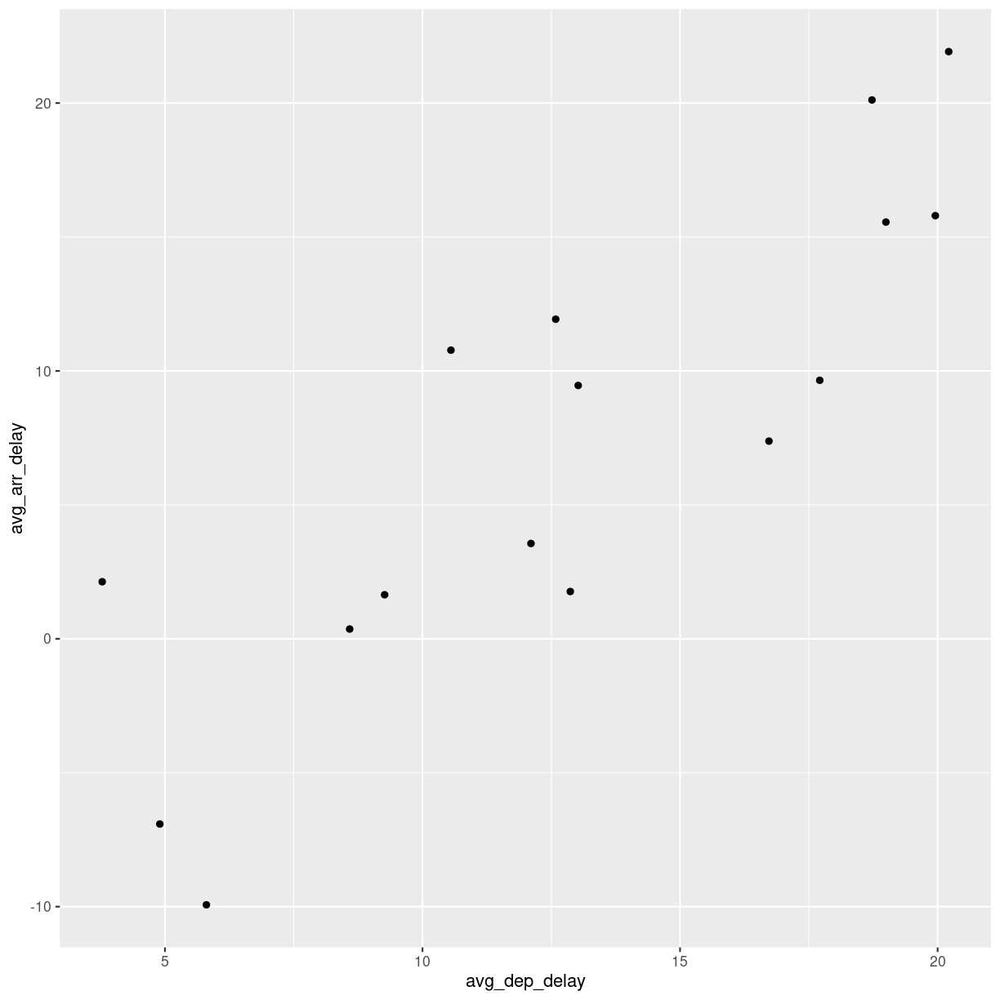
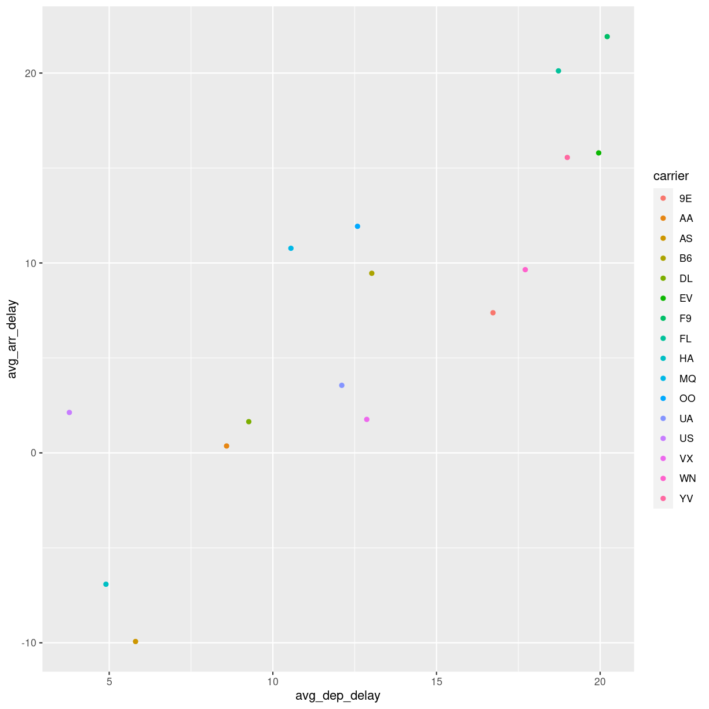
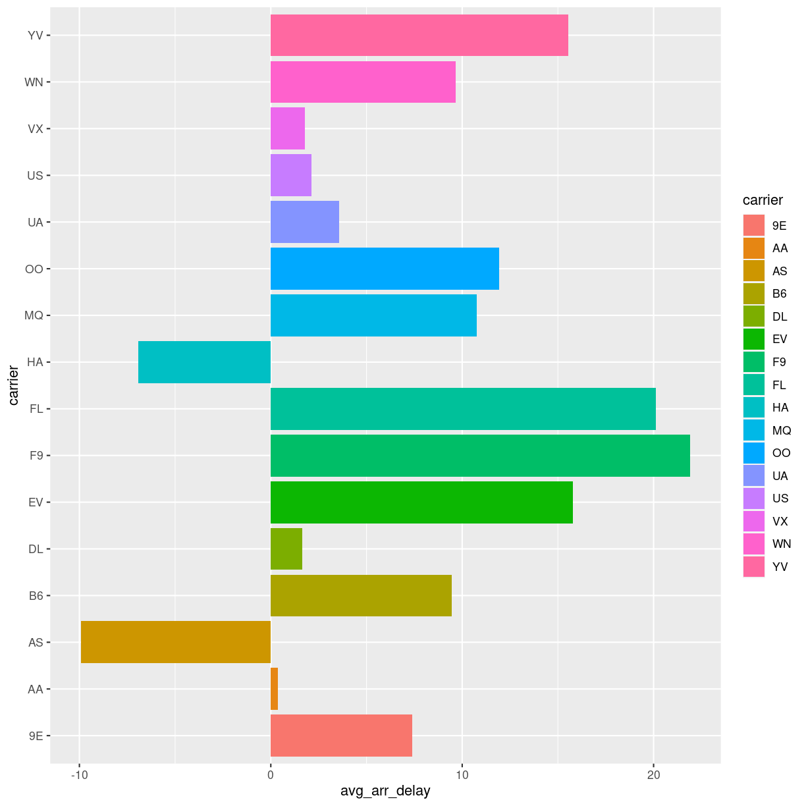

---
# Please do not edit this file directly; it is auto generated.
# Instead, please edit 03-dplyr-tidyr.md in _episodes_rmd/
title: "Joining data"
keypoints:
- FIXME
objectives:
- FIXME

questions:
- FIXME
teaching: 20
exercises: 10
source: Rmd
---

## What is the actual name of those airlines?

It is nice to be able to identify the airline that is most on time. 
But we have carrier codes, not the actual names of them.

How do we get that?

### Reading another sheet in a spreadsheet

Our spreadsheet contains more that one sheet. The second sheet 

~~~
carriers <- read_excel("../data/flightdata.xlsx", 2)
~~~
{: .language-r}

~~~
carriers <- read_excel("data/flightdata.xlsx", 2)
~~~
{: .language-r}

~~~
carriers
~~~
{: .language-r}

~~~
# A tibble: 16 × 2
   carrier name                       
   <chr>   <chr>                      
 1 9E      Endeavor Air Inc.          
 2 AA      American Airlines Inc.     
 3 AS      Alaska Airlines Inc.       
 4 B6      JetBlue Airways            
 5 DL      Delta Air Lines Inc.       
 6 EV      ExpressJet Airlines Inc.   
 7 F9      Frontier Airlines Inc.     
 8 FL      AirTran Airways Corporation
 9 HA      Hawaiian Airlines Inc.     
10 MQ      Envoy Air                  
11 OO      SkyWest Airlines Inc.      
12 UA      United Air Lines Inc.      
13 US      US Airways Inc.            
14 VX      Virgin America             
15 WN      Southwest Airlines Co.     
16 YV      Mesa Airlines Inc.         
~~~
{: .output}

We now have a second data frame, containing the names of the carriers. And we have
a data frame containing the average delays

~~~
delays
~~~
{: .language-r}

~~~
# A tibble: 16 × 3
   carrier avg_dep_delay avg_arr_delay
   <chr>           <dbl>         <dbl>
 1 9E              16.7          7.38 
 2 AA               8.59         0.364
 3 AS               5.80        -9.93 
 4 B6              13.0          9.46 
 5 DL               9.26         1.64 
 6 EV              20.0         15.8  
 7 F9              20.2         21.9  
 8 FL              18.7         20.1  
 9 HA               4.90        -6.92 
10 MQ              10.6         10.8  
11 OO              12.6         11.9  
12 UA              12.1          3.56 
13 US               3.78         2.13 
14 VX              12.9          1.76 
15 WN              17.7          9.65 
16 YV              19.0         15.6  
~~~
{: .output}

what we would like is something like this:

~~~
# A tibble: 16 × 4
   carrier name                        avg_dep_delay avg_arr_delay
   <chr>   <chr>                               <dbl>         <dbl>
 1 9E      Endeavor Air Inc.                   16.7          7.38 
 2 AA      American Airlines Inc.               8.59         0.364
 3 AS      Alaska Airlines Inc.                 5.80        -9.93 
 4 B6      JetBlue Airways                     13.0          9.46 
 5 DL      Delta Air Lines Inc.                 9.26         1.64 
 6 EV      ExpressJet Airlines Inc.            20.0         15.8  
 7 F9      Frontier Airlines Inc.              20.2         21.9  
 8 FL      AirTran Airways Corporation         18.7         20.1  
 9 HA      Hawaiian Airlines Inc.               4.90        -6.92 
10 MQ      Envoy Air                           10.6         10.8  
11 OO      SkyWest Airlines Inc.               12.6         11.9  
12 UA      United Air Lines Inc.               12.1          3.56 
13 US      US Airways Inc.                      3.78         2.13 
14 VX      Virgin America                      12.9          1.76 
15 WN      Southwest Airlines Co.              17.7          9.65 
16 YV      Mesa Airlines Inc.                  19.0         15.6  
~~~
{: .output}

What we want to do is joining the two dataframes, so we enrich the original
delays dataframe with the name matching the carrier code.

Several different types of joins exist. The one we need here is `left_join()`

!(left_join returns all rows in the left dataframe, enriched with data from the rigth)[../fig/left-join.gif]. 

~~~
delays %>% 
  left_join(carriers) 
~~~
{: .language-r}

~~~
Joining, by = "carrier"
~~~
{: .output}

~~~
# A tibble: 16 × 4
   carrier avg_dep_delay avg_arr_delay name                       
   <chr>           <dbl>         <dbl> <chr>                      
 1 9E              16.7          7.38  Endeavor Air Inc.          
 2 AA               8.59         0.364 American Airlines Inc.     
 3 AS               5.80        -9.93  Alaska Airlines Inc.       
 4 B6              13.0          9.46  JetBlue Airways            
 5 DL               9.26         1.64  Delta Air Lines Inc.       
 6 EV              20.0         15.8   ExpressJet Airlines Inc.   
 7 F9              20.2         21.9   Frontier Airlines Inc.     
 8 FL              18.7         20.1   AirTran Airways Corporation
 9 HA               4.90        -6.92  Hawaiian Airlines Inc.     
10 MQ              10.6         10.8   Envoy Air                  
11 OO              12.6         11.9   SkyWest Airlines Inc.      
12 UA              12.1          3.56  United Air Lines Inc.      
13 US               3.78         2.13  US Airways Inc.            
14 VX              12.9          1.76  Virgin America             
15 WN              17.7          9.65  Southwest Airlines Co.     
16 YV              19.0         15.6   Mesa Airlines Inc.         
~~~
{: .output}

The relocate function can be used to change the order of the columns:

~~~
delays %>% 
  left_join(carriers) %>% 
  relocate(name, .after = carrier)
~~~
{: .language-r}

## Can we plot the average delays?

Yes we can!

~~~
delays %>%  
  ggplot(mapping = aes(x = avg_dep_delay, y = avg_arr_delay)) +
  geom_point()
~~~
{: .language-r}

Maybe it would be a good idea to color the points based on carrier. That is,
we would like to map the carrier to the color of the points:

~~~
delays %>%  ggplot(mapping = aes(x = avg_dep_delay, y = avg_arr_delay, color = carrier)) +
  geom_point()
~~~
{: .language-r}

those points are not that useful

~~~
delays %>%  ggplot(mapping = aes(x = carrier, y = avg_arr_delay, fill = carrier)) +
  geom_col() +
  coord_flip()
~~~
{: .language-r}


