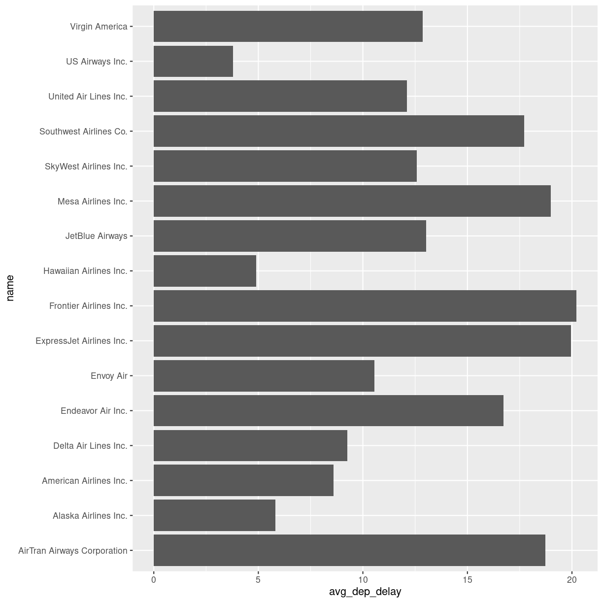

---
# Please do not edit this file directly; it is auto generated.
# Instead, please edit 03-joins.md in _episodes_rmd/
title: "Joining data"
teaching: 20
exercises: 10
questions:
- "How do I import data from other sheets in a spreadsheet?"
- "How do I enrich tables with additional data?"
- "What is a join?"
objectives:
- "Learn how to import data from sheet number 2 (and 3 etc) in spreadsheets"
- "Learn how to join data frames"
keypoints:
- "Data is often organized in separate tables, joining them can enrich the data we are analysing"
source: Rmd
---

## What is the actual name of the best airline?

It is nice to be able to identify the airline that is most on time. 
But we have carrier codes, not the actual names of them.

How do we get that?

### Reading another sheet in a spreadsheet

Our spreadsheet contains more that one sheet. The second sheet contains
the names and carrier codes of the relevant airlines.

We can read sheet number 2 from the Excelfile, by giving `read_excel()` a
second argument, specifying the sheet we want:

~~~
carriers <- read_excel("data/flightdata.xlsx", sheet = 2)
~~~
{: .language-r}

~~~
carriers
~~~
{: .language-r}

~~~
# A tibble: 16 × 2
   carrier name                       
   <chr>   <chr>                      
 1 9E      Endeavor Air Inc.          
 2 AA      American Airlines Inc.     
 3 AS      Alaska Airlines Inc.       
 4 B6      JetBlue Airways            
 5 DL      Delta Air Lines Inc.       
 6 EV      ExpressJet Airlines Inc.   
 7 F9      Frontier Airlines Inc.     
 8 FL      AirTran Airways Corporation
 9 HA      Hawaiian Airlines Inc.     
10 MQ      Envoy Air                  
11 OO      SkyWest Airlines Inc.      
12 UA      United Air Lines Inc.      
13 US      US Airways Inc.            
14 VX      Virgin America             
15 WN      Southwest Airlines Co.     
16 YV      Mesa Airlines Inc.         
~~~
{: .output}

We now have a second data frame, containing the names of the carriers. And we have
a data frame containing the average delays

~~~
summary_delays
~~~
{: .language-r}

~~~
# A tibble: 16 × 7
   carrier avg_dep_delay med_dep_delay sd_dep_delay max_dep_delay min_de…¹   iqr
   <chr>           <dbl>         <dbl>        <dbl>         <dbl>    <dbl> <dbl>
 1 US               3.78          -4           28.1           500      -19     7
 2 HA               4.90          -4           74.1          1301      -16     6
 3 AS               5.80          -3           31.4           225      -21    10
 4 AA               8.59          -3           37.4          1014      -24    10
 5 DL               9.26          -2           39.7           960      -33    10
 6 MQ              10.6           -3           39.2          1137      -26    16
 7 UA              12.1            0           35.7           483      -20    15
 8 OO              12.6           -6           43.1           154      -14    13
 9 VX              12.9            0           44.8           653      -20    12
10 B6              13.0           -1           38.5           502      -43    17
11 9E              16.7           -2           45.9           747      -24    23
12 WN              17.7            1           43.3           471      -13    19
13 FL              18.7            1           52.7           602      -22    21
14 YV              19.0           -2           49.2           387      -16    30
15 EV              20.0           -1           46.6           548      -32    30
16 F9              20.2            0.5         58.4           853      -27    22
# … with abbreviated variable name ¹​min_dep_delay
~~~
{: .output}

what we would like is something like this:

~~~
# A tibble: 16 × 8
   carrier name                    avg_d…¹ med_d…² sd_de…³ max_d…⁴ min_d…⁵   iqr
   <chr>   <chr>                     <dbl>   <dbl>   <dbl>   <dbl>   <dbl> <dbl>
 1 US      US Airways Inc.            3.78    -4      28.1     500     -19     7
 2 HA      Hawaiian Airlines Inc.     4.90    -4      74.1    1301     -16     6
 3 AS      Alaska Airlines Inc.       5.80    -3      31.4     225     -21    10
 4 AA      American Airlines Inc.     8.59    -3      37.4    1014     -24    10
 5 DL      Delta Air Lines Inc.       9.26    -2      39.7     960     -33    10
 6 MQ      Envoy Air                 10.6     -3      39.2    1137     -26    16
 7 UA      United Air Lines Inc.     12.1      0      35.7     483     -20    15
 8 OO      SkyWest Airlines Inc.     12.6     -6      43.1     154     -14    13
 9 VX      Virgin America            12.9      0      44.8     653     -20    12
10 B6      JetBlue Airways           13.0     -1      38.5     502     -43    17
11 9E      Endeavor Air Inc.         16.7     -2      45.9     747     -24    23
12 WN      Southwest Airlines Co.    17.7      1      43.3     471     -13    19
13 FL      AirTran Airways Corpor…   18.7      1      52.7     602     -22    21
14 YV      Mesa Airlines Inc.        19.0     -2      49.2     387     -16    30
15 EV      ExpressJet Airlines In…   20.0     -1      46.6     548     -32    30
16 F9      Frontier Airlines Inc.    20.2      0.5    58.4     853     -27    22
# … with abbreviated variable names ¹​avg_dep_delay, ²​med_dep_delay,
#   ³​sd_dep_delay, ⁴​max_dep_delay, ⁵​min_dep_delay
~~~
{: .output}

What we want to do is joining the two dataframes, so we enrich the original
dataframe containing summary statistics on departure delays, 
with the name matching the carrier code.

Several different types of joins exist. The one we need here is `left_join()`

. 

With a `left_join()` we join the two dataframes. All rows in the left dataframe
are returned, enriched with the matching values from the columns in the right
dataframe. Rows in the left dataframe, that does not have a matching row in
the right dataframe will get NA-values.

Let us do that!

~~~
summary_delays %>% 
  left_join(carriers) %>% 
  relocate(name, .after = carrier) 
~~~
{: .language-r}

~~~
Joining with `by = join_by(carrier)`
~~~
{: .output}

~~~
# A tibble: 16 × 8
   carrier name                    avg_d…¹ med_d…² sd_de…³ max_d…⁴ min_d…⁵   iqr
   <chr>   <chr>                     <dbl>   <dbl>   <dbl>   <dbl>   <dbl> <dbl>
 1 US      US Airways Inc.            3.78    -4      28.1     500     -19     7
 2 HA      Hawaiian Airlines Inc.     4.90    -4      74.1    1301     -16     6
 3 AS      Alaska Airlines Inc.       5.80    -3      31.4     225     -21    10
 4 AA      American Airlines Inc.     8.59    -3      37.4    1014     -24    10
 5 DL      Delta Air Lines Inc.       9.26    -2      39.7     960     -33    10
 6 MQ      Envoy Air                 10.6     -3      39.2    1137     -26    16
 7 UA      United Air Lines Inc.     12.1      0      35.7     483     -20    15
 8 OO      SkyWest Airlines Inc.     12.6     -6      43.1     154     -14    13
 9 VX      Virgin America            12.9      0      44.8     653     -20    12
10 B6      JetBlue Airways           13.0     -1      38.5     502     -43    17
11 9E      Endeavor Air Inc.         16.7     -2      45.9     747     -24    23
12 WN      Southwest Airlines Co.    17.7      1      43.3     471     -13    19
13 FL      AirTran Airways Corpor…   18.7      1      52.7     602     -22    21
14 YV      Mesa Airlines Inc.        19.0     -2      49.2     387     -16    30
15 EV      ExpressJet Airlines In…   20.0     -1      46.6     548     -32    30
16 F9      Frontier Airlines Inc.    20.2      0.5    58.4     853     -27    22
# … with abbreviated variable names ¹​avg_dep_delay, ²​med_dep_delay,
#   ³​sd_dep_delay, ⁴​max_dep_delay, ⁵​min_dep_delay
~~~
{: .output}

The relocate function is used to change the order of the columns.

## There are other join functions

`left_join` is an example of a mutating join. Like the `mutate` function
left_join introduces new variables, new columns, in our dataframe.

### Mutating joins

The closes cousin of the `left_join` funtion is the `right_join`. 

The left_join returns all rows on the left hand side of the join,
augmented with values from the dataframe on the right hand side of the
join, based on matching values.

The right_join function returns all rows on the right hand side of the join. Depending on the flow of our code, we choose the variant that best suit our purpose.

`inner_join` keeps only the rows on the left hand side of the join, that have matching values in the dataframe on the right hand side of the join. Whereas `left_join` and `right_join` keeps all rows, and add NA values where there is no match, `inner_join` only returns rows that have a match. 

`full_join` on the other hand keeps all rows from both dataframes being joined. Any observations that does not have a match in the other dataframe, will have NA values added.

### Filtering joins

These joins will filter rows from the left hand dataframe, based on the
presence or absence of matches in the right hand dataframe.

`semi_join` returns all rows that have a match on the right hand side of the join. But not those that do not have a match.

`anti_join` returns all rows, that *do not* have a match on the rigth hand side of the join.

## Can we plot the average delays with carrier names?

Yes we can!

We take the summary_delays dataframe, containing the average delays,
and join it with the data on carrier names. We do not have to specify the column on which we are joining, since there is only one shared column name. We then pipe that result to ggplot, where we specify that we would like the delay to be on the x-axis, and the name of the carrier on the y-axis:

~~~
summary_delays %>% 
  left_join(carriers) %>% 
  ggplot(mapping = aes(x = avg_dep_delay, y = name)) +
    geom_col()
~~~
{: .language-r}

~~~
Joining with `by = join_by(carrier)`
~~~
{: .output}


