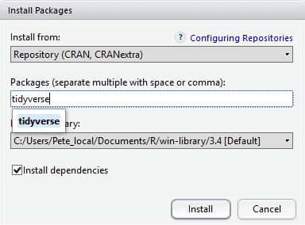

```{r, include = FALSE}
source("../bin/chunk-options.R")
knitr_fig_path("01-")
source("../bin/download_data.R")
```

### Downloading the data and getting set up

For this lesson we will use the following folders in our working directory:
**`data/`**, **`data_output/`** and **`fig_output/`**. Let's write them all in
lowercase to be consistent. We can create them using the RStudio interface by
clicking on the "New Folder" button in the file pane (bottom right), or directly
from R by typing at console:

```{r create-dirs, eval = FALSE}
dir.create("data")
dir.create("data_output")
dir.create("fig_output")
```

Begin by downloading the dataset called
"`SAFI_clean.csv`". The direct download link is:
<https://raw.githubusercontent.com/KUBDatalab/R-intro/main/data/flightdata.xlsx>. Place this downloaded file in
the `data/` you just created. You can do this directly from R by copying and
pasting this in your terminal (your instructor can place this chunk of code in
the Etherpad):

```{r download-data, eval = FALSE}
download.file("https://raw.githubusercontent.com/KUBDatalab/R-intro/main/data/flightdata.xlsx",
              "data/flightdata.xlsx", mode = "wb")
```


## Installing additional packages using the packages tab

In addition to the core R installation, there are in excess of
18,000 additional packages which can be used to extend the
functionality of R. Many of these have been written by R users and
have been made available in central repositories, like the one
hosted at CRAN, for anyone to download and install into their own R
environment. You should have already installed the packages 'ggplot2'
and 'dplyr. If you have not, please do so now using these instructions.

You can see if you have a package installed by looking in the `packages` tab
(on the lower-right by default). You can also type the command
`installed.packages()` into the console and examine the output.


Additional packages can be installed from the ‘packages’ tab.
On the packages tab, click the ‘Install’ icon and start typing the
name of the package you want in the text box. As you type, packages
matching your starting characters will be displayed in a drop-down
list so that you can select them.



At the bottom of the Install Packages window is a check box to
‘Install’ dependencies. This is ticked by default, which is usually
what you want. Packages can (and do) make use of functionality
built into other packages, so for the functionality contained in
the package you are installing to work properly, there may be other
packages which have to be installed with them. The ‘Install
dependencies’ option makes sure that this happens.


> ## Exercise
>
> Use both the Console and the Packages tab to confirm that you have the tidyverse
> installed.
>
> > ## Solution
> > Scroll through packages tab down to ‘tidyverse’.  You can also type a few
> > characters into the searchbox.
> > The ‘tidyverse’ package is really a package of packages, including
> > 'ggplot2' and 'dplyr', both of which require other packages to run correctly.
> > All of these packages will be installed automatically. Depending on what
> > packages have previously been installed in your R environment, the install of
> > ‘tidyverse’ could be very quick or could take several minutes. As the install
> > proceeds, messages relating to its progress will be written to the console.
> > You will be able to see all of the packages which are actually being
> > installed.
> {: .solution}
{: .challenge}

Because the install process accesses the CRAN repository, you
will need an Internet connection to install packages.

It is also possible to install packages from other repositories, as
well as Github or the local file system, but we won’t be looking at these options in this lesson.


## Installing additional packages using R code

If you were watching the console window when you started the
install of ‘tidyverse’, you may have noticed that the line

```{r, eval = FALSE}
install.packages("tidyverse")
```

was written to the console before the start of the installation messages.

You could also have installed the **`tidyverse`** packages by running this command directly at the R terminal.

We need an extra package to read Excel data. Install it by running this command:

```{r, eval = FALSE}
install.packages("readxl")
```


